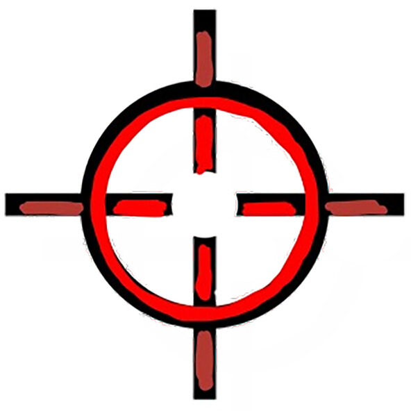

<p align="center">
    </img>
</p>


<h1 align="center">ipad-curosr-hexo</h1>

<p align="center">
 ipad cursor style that can be used in your hexo framework
</p>

<p align="center">
  
  
</p>

<p align="center">
  <a href="https://zqqcee.github.io/">
    
  </a>
</p>
## Inspiration

Inspired by [CatsJuice/ipad-cursor](https://github.com/CatsJuice/ipad-cursor), Add ipad cursor into your hexo(NexT theme) blog in a **configurable way**.

**See [add ipad-cursor into my hexo blog](https://zqqcee.github.io/2023/07/23/ebae3e5deab8/) for more details :)**

## Principle

**core: add `data-cursor='block'` or `data-cursor='text'` to the tag with `document.querySelector`, like :**

Before:

```html
<div></div>
<p></p>
```

After:

```html
<div data-cursor="block"></div>
<p data-cursor="text"></p>
```

> principle of ipad-cursor：
>
> When `init` called, it will remove default cursor, and generate a fake cursor use `div` element. Then listen `mousemove` event, and move the fake cursor to the mouse position.
>
> After init finished, it will call `updateCursor` method, scan element with `data-cursor` attribute, detect the cursor type, and add event listener to the element.
>
> When mouse enter the element, apply styles.

## Install

In hexo, You can only install in this way:

```js
import init from "https://unpkg.com/ipad-cursor-hexo@latest"
```

## Usage

### Basic Usage

- **Step1**: Create a directory named `ipad-cursor-hexo` in `${SourcePath}/themes/next/source/js`

- **Step2**: Create a `js` file named `index.js` in `${SourcePath}/themes/next/source/js/ipad-cursor-hexo`.

- **Step3:** Write **configuration**,see [config](#config) for more detail

- **Step4:** Let `document` listen `DOMContentLoaded` events, bind `init` function onto it.

  - If you haven't any configuration:
  
    `document.addEventListener('DOMContentLoaded', ()=>init());`
  
  - If you have some configuration:
  
    `document.addEventListener('DOMContentLoaded', () => init(config, cursorConfig,effect));`
  
- **Step5:** link the above `index.js` file to hexo blog.

  - **Step5.1:** Open `${SourcePath}/themes/next/layout/_partials/head/head.swig`
  - **Step5.2:** Add `<script src="/js/ipad-cursor-hexo/index.js" type="module"></script>` into the file

### Advanced Usage

After excute the five steps in **basic-usage**, you will see a ipad-cursor ⚪️ in your blog.

Moreover, you can custom :

1. which tag and what kind of style you want to config.
2. What is your cursor look like.
3. effect

**See [Config](#config) for more detail.**

### Config

#### 1. bind `data-cursor` to the tag

For the first, you can config which tag and what kind of style you want to config, for example:

If you want to config the `<div id="article"></div>` to the `text` cursor style. you can write the configuration like this:

The `key` is you want to use in `document.querySelectorAll`,

```js
const config = {
  "div#article":{
    type:'text',
  },
}
```

If you want to config its `cursor-style`, you can add the configuration like this:

```js
const config = {
  "div#article":{
    type:'text',
    style:'radius:50%'
  },
}
```

If you want to configure all of the `<a>` in the `<div id="article">` to the `block` style. you can add the configuration like this:

```
const config = {
  "div#article":{
    type:'text',
    style:'radius:50%'
    children:{
    	"a":{
          type:"block",
    	}
    }
  },
}
```

#### 2. cursor style

For the second, you can config what is your cursor look like,like `background`,`width`,`height`,etc.

config it like this:

```js
const cursorConfig = {
  normalStyle: {
    background: '#ffcc00',
  },
  textStyle: {
    background: '#ffcc00'
  },
}
```

#### 3. effect

you can do some else in the effect function, like `useEffect` in `react`. In my blog, I use this to stop `` from being selected.

```js
const effect = () => {
	document.querySelector('img').style.userSelect = 'none'
}
```

## My Usage

#### config.js

```js
export const config = {
    "ul#menu>li.menu-item": {
        type: 'block',
    },
    "article": {
        type: 'text',
        children: {
            "a": {
                type: 'block',
            }
        }
    },
    "div.post-body": {
        type: 'text'
    },
    "ul.motion-element>li": {
        type: "block"
    },
    //sidebar
    "div.sidebar-inner": {
        type: 'text'
    },
    "p": {
        type: 'text'
    },
    "a": {
        type: 'block'
    },
};

export const cursorConfig = {
    normalStyle: {
        background: '#ffcc00',
    },
    textStyle: {
        background: '#ffcc00'
    },
}
```

#### index.js

```js
import init from "https://unpkg.com/ipad-cursor-hexo@latest";

import { config, cursorConfig } from "./config.js" 
const effect = () => {
    document.querySelector('img').style.userSelect = 'none'
}

document.addEventListener('DOMContentLoaded', () => init(config, cursorConfig,effect));
```

## **Notice**

In hexo, some tags are very difficult to locate with id or class, like:

`<a href="/" rel="section"></a>`

or

```html
<div id="menu-container">
  <ul id="menu">
    <li></li>
    <li></li>
    <li></li>
  </ul>
</div>
```

For the former, you have to add `id` locator into the `.swig` file **(you can use global search in vscode to find them).**

For the later, you can use a special selector that we support, like `"div#menu-container>ul#menu"`:

```js
const config = {
  "div#menu-container>ul#menu":{
      type:'block'
  }
}
```

## Case

[zqqcee.github.io](https://zqqcee.github.io/)

## Reference

Great thanks for [@CatsJuice](https://github.com/CatsJuice), and this great project [ipad-cursor](https://github.com/CatsJuice/ipad-cursor).

**Ref:**

- 🔥：[ipad-cursor](https://github.com/CatsJuice/ipad-cursor)
- 🔥：[oooo.so](https://oooo.so)
- 🔥：[ipad-cursor.oooo.so](https://ipad-cursor.oooo.so)
